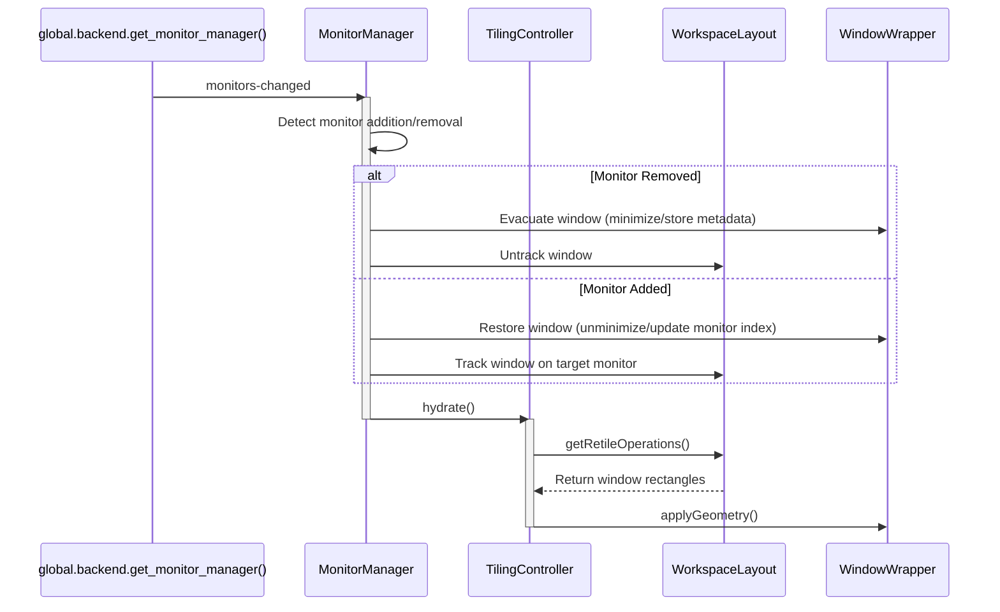
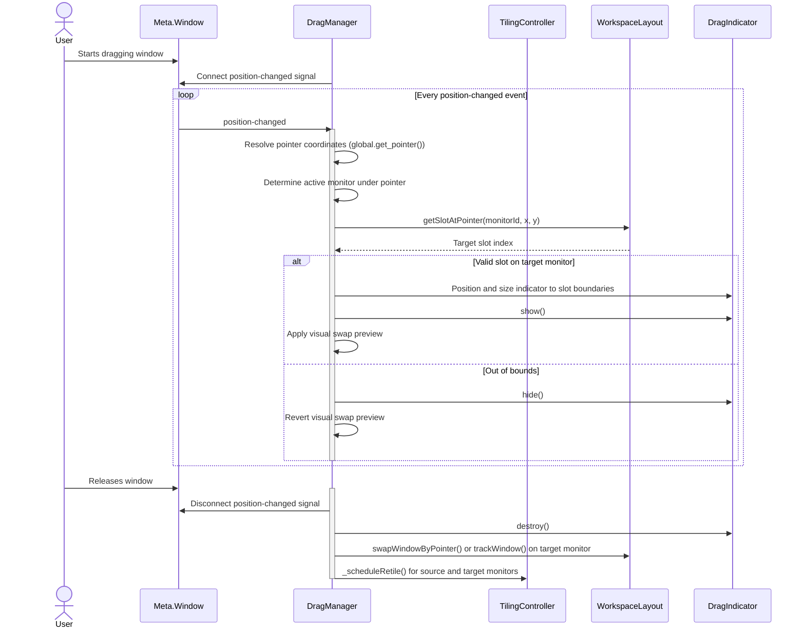

# Multi-Monitor Refactoring Plan

## Architecture Analysis & Responsibility Shifts

This section details updates to files and classes to support workspaces spanning multiple displays.

| File Path | Target Class | Role & Proposed Architecture Updates |
|---|---|---|
| `lib/workspace.js` | `WorkspaceLayout` | Allocates slots per workspace and monitor. Handles cross-monitor actions (like switching monitors, closing monitor windows, and workspace porting) and integrates cross-monitor navigation fallback by querying adjacent monitor state trackers when spatial boundaries are reached. |
| `lib/drag.js` | `DragManager` | Tracks drag positions. Implements cross-monitor pointer-to-slot mapping, renders visual indicators on target monitors, and coordinates visual swaps across monitor boundaries. |
| `lib/keybindings.js` | `KeybindingManager` | Resolves and binds keyboard shortcuts. Delegates focus-switching and window-movement actions to the controller, supporting boundary traversal to adjacent displays. |
| `lib/monitor.js` | `MonitorManager` | Tracks display topologies. Listens to hardware changes via backend signals, and manages transient storage for windows evicted by monitor unplug events (leaving cross-monitor actions to Workspace). |
| `lib/controller.js` | `TilingController` | Orchestrates operations. Coordinates window state changes between workspace layouts, coordinates drag state initialization/termination, and dispatches batch updates to avoid layout thrashing. |

### Responsibility Changes

* `WorkspaceLayout` / `WorkspaceManager`: Tracks logical state mapped per monitor ID. Spatial search fallbacks to adjacent monitors when keyboard navigation hits display edges. Handles cross-monitor actions (switching monitors, closing monitor windows, workspace porting).
* `DragManager`: Evaluates pointer location globally. Renders indicators relative to target displays and manages preview transitions across screens.
* `MonitorManager`: Listens to topology updates, matching logical monitors to stable physical IDs. Manages transient storage/metadata for windows evicted by monitor unplug events (uses existing evacuation logic, does not destroy windows, preserves state).
* `TilingController`: Dispatches coordinates and sizes to the correct target workspace layout based on pointer position or active focus.

---

## Core Multi-Monitor Scenarios

### Dynamic Handling of Monitor Hotplug Events

* Proposed GNOME Shell Signals:
  * `monitors-changed`: Connected via `global.backend.get_monitor_manager()` to detect display hardware hotplug and configuration updates.
  * `size-changed`: Connected on tracked windows or workspace boundaries to trigger retiling upon size changes or display resolution alterations.
* Evacuation Logic:
  * Detects removed displays by comparing active stable monitor IDs against cached IDs.
  * Use existing logic; do not destroy windows, preserve state. Specifically, minimize windows instead of deleting/destroying them, untrack them, and record their original monitor, workspace, and slot in `MonitorManager._evacuatedWindows` for later restoration.
* Restoration Logic:
  * Restores minimized windows to their original slots when matching displays reconnect.
  * Triggers workspace hydration to update tiling allocations on target displays.

### Cross-Monitor Drag-and-Drop

* Pointer Intersection Tracking:
  * Resolves absolute coordinates from `global.get_pointer()` during window drag.
  * Queries `global.display.get_monitor_index_for_rect` to identify the monitor containing the pointer.
* Visual Drop Feedback:
  * Renders a `St.Widget` backdrop overlay within the resolved slot geometry on the target display.
  * Applies visual preview layout updates on the target display by shifting target windows out of the hovered slot.

### Keyboard Shortcuts for Cross-Monitor Focus and Movement

* Focus Navigation Fallback:
  * Triggers when intra-monitor focus search returns no window in the requested direction.
  * Locates the adjacent monitor index and targets the corresponding slot tracker.
  * Focuses the boundary window on the adjacent display.
  * Goalslot fallback: Resolve via adjacent edge. If multiple windows intersect, pick the one with highest overlap. If equal overlap, pick the top/right one.
* Window Transference:
  * Moves the active window to the adjacent monitor when moving past the monitor border.
  * Registers the window with the target monitor's state tracker and triggers retiling on both screens.
  * Shift cross-monitor actions (like moving windows across monitors, switching monitors, closing monitor windows, workspace porting) from Monitor to Workspace.

---

## Mermaid Diagrams

### Hotplug Event Handling Sequence



### Cross-Monitor Drag-and-Drop Sequence



---

## Pseudo-code

### Pointer-to-Slot Mapping and Indicator Rendering

```javascript
// Located in lib/drag.js
_handlePositionChanged(wrapper, layout, tracker, originalSlot, indicator) {
    const [pointerX, pointerY] = global.get_pointer();
    const gaps = this.controller.settings.getGaps();
    const workspace = wrapper.workspace;
    
    // Identify monitor matching pointer coordinates
    const monitorIndex = global.display.get_monitor_index_for_rect({
        x: pointerX,
        y: pointerY,
        width: 1,
        height: 1
    });
    
    // Guard against out-of-bounds monitor index
    if (monitorIndex === -1) {
        indicator.hide();
        const fallbackMonitorIndex = global.display.get_current_monitor();
        const fallbackRect = workspace.get_work_area_for_monitor(fallbackMonitorIndex);
        this._revertVisualSwap(tracker, layout, fallbackRect, gaps);
        return;
    }
    
    const monitorId = this.controller.monitorManager.getMonitorId(monitorIndex);
    const targetLayout = this.controller.workspaceManager.getLayout(workspace);
    const targetTracker = targetLayout._getTracker(monitorId);
    const monitorRect = workspace.get_work_area_for_monitor(monitorIndex);
    
    let targetRect = null;
    let hoveredSlot = -1;
    
    // Handle empty monitor drop target explicitly
    if (targetTracker.size === 0) {
        hoveredSlot = 0;
        targetRect = {
            x: monitorRect.x + gaps.outer,
            y: monitorRect.y + gaps.outer,
            width: monitorRect.width - (gaps.outer * 2),
            height: monitorRect.height - (gaps.outer * 2)
        };
    } else {
        hoveredSlot = targetLayout.getSlotAtPointer(monitorId, pointerX, pointerY, monitorRect, gaps);
        if (hoveredSlot !== -1) {
            const matrix = targetLayout.escalator.getLayoutForCount(targetTracker.size);
            const estate = matrix.getEstate(hoveredSlot);
            if (estate) {
                targetRect = estate.toAbsolute(monitorRect, gaps);
            } else {
                hoveredSlot = -1;
            }
        }
    }
    
    if (hoveredSlot !== -1 && targetRect) {
        // Update indicator layout coordinates and display
        indicator.set_position(targetRect.x, targetRect.y);
        indicator.set_size(targetRect.width, targetRect.height);
        if (indicator._bg) {
            indicator._bg.set_size(targetRect.width, targetRect.height);
        }
        indicator.show();
        
        // Apply preview layout modifications
        if (monitorId !== wrapper.monitorId) {
            this._applyCrossMonitorVisualSwap(wrapper, targetTracker, targetLayout, hoveredSlot, monitorRect, gaps);
        } else {
            this._applyVisualSwap(tracker, layout, originalSlot, hoveredSlot, monitorRect, gaps);
        }
    } else {
        indicator.hide();
        this._revertVisualSwap(tracker, layout, monitorRect, gaps);
    }
}
```

### Cross-Monitor Keyboard Navigation Fallback

```javascript
// Located in lib/workspace.js
_getTargetWindowInDirection(monitorId, window, direction) {
    const tracker = this._getTracker(monitorId);
    const slot = tracker.getSlot(window);
    if (slot === undefined) return null;
    
    const windowCount = tracker.size;
    const layout = this.escalator.getLayoutForCount(windowCount);
    if (!layout) return null;
    
    const estate = layout.getEstate(slot);
    if (!estate) return null;
    
    // Evaluate spatial targets within same monitor
    const targetSlot = this._findTargetSlotInDirection(layout, slot, estate, direction);
    if (targetSlot !== -1) {
        return tracker.windows.find(w => tracker.getSlot(w) === targetSlot) || null;
    }
    
    // Fetch boundary adjacent display
    const currentMonitorIndex = this.workspace.get_display().get_monitor_index_for_rect(window.get_frame_rect());
    const adjacentMonitorIndex = this.controller.monitorManager.getMonitorInDirection(currentMonitorIndex, direction);
    if (adjacentMonitorIndex === -1) return null;
    
    const targetMonitorId = this.controller.monitorManager.getMonitorId(adjacentMonitorIndex);
    const targetTracker = this._getTracker(targetMonitorId);
    if (targetTracker.size === 0) return null;
    
    // Match coordinate boundary overlap on adjacent display via adjacent edge
    return this._findClosestBoundaryWindow(targetTracker, direction, window.get_frame_rect());
}

_findClosestBoundaryWindow(targetTracker, direction, sourceRect) {
    let candidates = [];
    for (const win of targetTracker.windows) {
        if (!win || win.unmanaged) continue;
        const targetRect = win.get_frame_rect();
        
        let overlap = 0;
        if (direction === 'left' || direction === 'right') {
            // Overlap along Y axis
            overlap = Math.max(0, Math.min(sourceRect.y + sourceRect.height, targetRect.y + targetRect.height) - Math.max(sourceRect.y, targetRect.y));
        } else if (direction === 'up' || direction === 'down') {
            // Overlap along X axis
            overlap = Math.max(0, Math.min(sourceRect.x + sourceRect.width, targetRect.x + targetRect.width) - Math.max(sourceRect.x, targetRect.x));
        }
        
        if (overlap > 0) {
            candidates.push({ win, rect: targetRect, overlap });
        }
    }
    
    if (candidates.length === 0) return null;
    
    candidates.sort((a, b) => {
        if (b.overlap !== a.overlap) {
            return b.overlap - a.overlap; // Highest overlap first
        }
        // If equal overlap, pick the top/right one
        if (direction === 'left' || direction === 'right') {
            return a.rect.y - b.rect.y; // Top-most (smaller Y)
        } else {
            return b.rect.x - a.rect.x; // Right-most (larger X)
        }
    });
    
    return candidates[0].win;
}
```

### Cross-Monitor Keyboard Window Movement

```javascript
// Located in lib/workspace.js
moveWindowDirection(monitorId, window, direction) {
    const tracker = this._getTracker(monitorId);
    const slot = tracker.getSlot(window);
    if (slot === undefined) return false;
    
    const windowCount = tracker.size;
    const layout = this.escalator.getLayoutForCount(windowCount);
    if (!layout) return false;
    
    const estate = layout.getEstate(slot);
    if (!estate) return false;
    
    // Evaluate spatial targets within same monitor
    const targetSlot = this._findTargetSlotInDirection(layout, slot, estate, direction);
    if (targetSlot !== -1) {
        const targetWindow = tracker.windows.find(w => tracker.getSlot(w) === targetSlot);
        if (targetWindow) {
            tracker.swapWindows(window, targetWindow);
            this.controller.scheduleRetile(this.workspace, monitorId);
            return true;
        }
    }
    
    // Fallback: cross-monitor window movement
    const currentMonitorIndex = this.workspace.get_display().get_monitor_index_for_rect(window.get_frame_rect());
    const adjacentMonitorIndex = this.controller.monitorManager.getMonitorInDirection(currentMonitorIndex, direction);
    if (adjacentMonitorIndex === -1) return false;
    
    const targetMonitorId = this.controller.monitorManager.getMonitorId(adjacentMonitorIndex);
    
    // Untrack from source monitor tracker
    tracker.untrack(window);
    
    // Track on target monitor tracker
    const targetTracker = this._getTracker(targetMonitorId);
    targetTracker.track(window, targetTracker.size);
    
    // Update window wrapper cache/metadata
    const wrapper = this.controller.getWindowWrapper(window);
    if (wrapper) {
        wrapper.monitorId = targetMonitorId;
        wrapper.monitorIndex = adjacentMonitorIndex;
    }
    
    // Physical transfer using GNOME Shell API
    window.move_to_monitor(adjacentMonitorIndex);
    
    // Schedule retiles on both source and target monitors
    this.controller.scheduleRetile(this.workspace, monitorId);
    this.controller.scheduleRetile(this.workspace, targetMonitorId);
    
    return true;
}
```

### Cross-Monitor Workspace Actions (Shifted from MonitorManager)

```javascript
// Located in lib/workspace.js (WorkspaceLayout / WorkspaceManager)
closeMonitorWindows(monitorIndex, includeMinimized) {
    const workspace = this.workspace || global.workspace_manager.get_active_workspace();
    if (!workspace) return;
    this.controller.setBatchMode(true);
    const windows = workspace.list_windows();
    windows.forEach(w => {
        if (w.get_monitor() === monitorIndex && (!w.minimized || includeMinimized)) {
            w.delete(global.get_current_time());
        }
    });
    this.controller.setBatchMode(false);
    this.controller.hydrate(workspace);
}

switchMonitors(activeMonitorIndex) {
    const workspace = this.workspace || global.workspace_manager.get_active_workspace();
    if (!workspace) return;
    
    const manager = global.backend.get_monitor_manager();
    const numMonitors = manager.get_logical_monitors().length;
    if (numMonitors < 2) return;

    let targetMonitorIndex;
    if (numMonitors === 2) {
        targetMonitorIndex = activeMonitorIndex === 0 ? 1 : 0;
    } else {
        const primaryIndex = global.display.get_primary_monitor();
        if (activeMonitorIndex === primaryIndex) return;
        targetMonitorIndex = primaryIndex;
    }

    this.controller.setBatchMode(true);
    const windows = workspace.list_windows();
    windows.forEach(w => {
        const m = w.get_monitor();
        if (m === activeMonitorIndex) {
            w.move_to_monitor(targetMonitorIndex);
        } else if (m === targetMonitorIndex) {
            w.move_to_monitor(activeMonitorIndex);
        }
    });
    this.controller.setBatchMode(false);
    this.controller.hydrate(workspace);
}

portMonitorToWorkspace(monitorIndex, direction) {
    const activeWorkspaceIndex = global.workspace_manager.get_active_workspace_index();
    const numWorkspaces = global.workspace_manager.n_workspaces;
    let targetIndex = activeWorkspaceIndex;

    if (direction === 'left' && activeWorkspaceIndex > 0) {
        targetIndex--;
    } else if (direction === 'right' && activeWorkspaceIndex < numWorkspaces - 1) {
        targetIndex++;
    }

    if (targetIndex === activeWorkspaceIndex) return;

    const targetWorkspace = global.workspace_manager.get_workspace_by_index(targetIndex);
    const activeWorkspace = this.workspace || global.workspace_manager.get_active_workspace();

    this.controller.setBatchMode(true);
    const windows = activeWorkspace.list_windows();
    windows.forEach(w => {
        if (w.get_monitor() === monitorIndex) {
            w.change_workspace(targetWorkspace);
        }
    });
    this.controller.setBatchMode(false);
    
    this.controller.hydrate(activeWorkspace);
    this.controller.hydrate(targetWorkspace);
}
```

